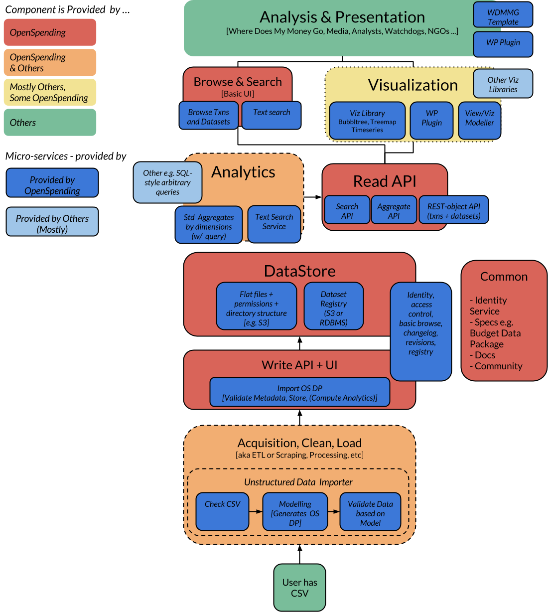

This document represents reflections and a proposal that distil understanding
(and thoughts) on where OpenSpending should be going in terms of approach and
architecture.

## Purpose and Approach

Single statement summary:

> We want to centralize data but decentralize "presentation" ("views")

By "presentation" (views) I mean presentations of that data to people in the
broadest sense - it could be a visualization and discussion in a news article
or a dedicated site like Where Does My Money Go.

To elaborate this a bit, it means:

1. OS provides a single central repository of open data on government (and
   corporate) finances
2. OS provides good access (APIs, dumps) but quite basic presentation of that
   data (browser, some viz)
3. Most of the presentation of that data happens on non-OS sites but using OS
   data (via the API, via dump etc)

Some of 3 may be done by members of the "OpenSpending" community and we care a
great deal about 3 (that stuff is the point of having 1+2).

BUT OpenSpending, at least as a technical project, is focused on 1+2.

This means OpenSpending technically is primarily about:

- DB: Maintaining that central repository (note this need *not* be a classic
  relational DB - it could be files on s3 or ...)
- ETL: Providing means to get data into that repository (ETL)
- API + Dumps: Providing means to get data out of that repository

For core there is *limited* provision of:

- Viz: providing off the shelf visualizations
- Analytics: providing ways to do analysis on that data

Note that on Viz and Analytics *in core* we provide only limited functionality
of the demonstrator or essential kind - there are lots of visualizations and
analyses that can be done and many ways to do it and OS at the core can and
should do only a little. (This does *not* mean that substantial analysis and
presentation cannot take place within the wider OpenSpending *project* -- there
can, and should be, lots of this but it would be *outside* of core).

Aside: analogies with OpenStreetMap. I continue to find analogies with OSM
incredibly useful. Few people see OSM data or maps via openstreetmap.org.
Instead they see or use that data in sites or products elsewhere (e.g.
FourSquare). OSM's core is the central DB, the data adding tools and the
API/Dumps. Viz even in the form of essential things like mapnik and tile
production now largely happens in other projects that are a part of the
community but not OSM "core".

## Proposal

The future plan for OpenSpending technical development is summarized in the
following two diagrams (which present similar information in slightly different
ways).

Key aspects of the proposed approach:

* Clear distinction of responsibilities of OpenSpending platform technically vs
  work done elsewhere. The demarcation largely follows the discussion above
  with Storage, some ETL and some analytics done in OpenSpending core and the
  majority of presentation done by third-party users. In essence we are
  proposing a hybrid system similar to OpenStreetMap:

  * Central Repository (and permissions for access) - the DataStore
  * Presentation (and use and analysis) is distributed

* Use a (micro-)services oriented architecture in which different pieces
  of functionality are implmented in separate small service components (or
  libraries) which are then connected together. This will make it easier to
  contribute, easier to improve and provide a simpler and more robust
  deployment and hosting architecture.

  * This will involve moving away from the current architecture that has all of
    storage, analytics, presentation and visualization in one monolithic webapp
  * As there is now freedom to implement different micro-services in different languages we make the following recommendation that services are implemented in either Python or Javascript with Python preferred for backend and Javascript for frontend.

### Components Overview

### Components and Micro-Service Subcomponents

### Subcomponents Simplified with Flow of Data

------

## Appendix - Additional Thoughts

1. Optimize ETL
   * Getting data in is essential
   * This is about people as much as tools
   * Maximize structure and reliability
2. We should not care about OS.org traffic or SEO for normal users. What we
   care about is API usage.
   * We should start measuring API usage asap ...
3. Enabling people to build satellite sites or embed viz is our priority
   * We have made huge strides in this direction ... but we can do more
   * E.g. why focus on satellite sites in wordpress
   * Make it easier to get data slices
